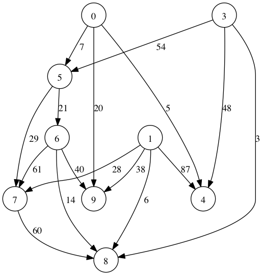

###Algorithms & Data Structures in C++

####目标 ( goal ) :

   1. 经典的算法实现      
      (classical algorithms implementations)      
   2. 服务器端       
      (based on linux/gcc)       
   3. 正确，易于使用和改造, 一个头文件一个算法，并附带一个demo.       
      (correct! and ease of use, one .header file per algorithm)        

####约定 ( Convention ):

   1.  一个算法用一个.h文件表示放到include下. ( one .header file per algorithm. )
   2.  算法演示的demo程序放到src下.  ( one demo per algorithm.  )
   3.  程序正确通过后，请发起Pull Requests，代码被验证后入库，并在README中发布新算法实现。
       (Please Use Fork+Pull Requests !!! Correctness is the most important!)
   4.  TAB = 4 space.  set ts=4 in vim
   5.  Graph的输出格式为 [Graphviz](http://www.graphviz.org/) Dot格式.
   	(the output format of the graph is in dot of graphviz.)
   	eg:
   	

####已实现 ( Implemented ):

    Array shuffle
    Prime test(trial division)
    Prime test(Miller-Rabin's method)
    2D Array
    Arbitary Integer
    Linear congruential generator
    Maximum subarray problem

    Bit-Set
    Queue
    Stack
    Binary Heap
	Fibonacci Heap
    Priority Queue (list based)

	Bubble sort
	Selection sort
    Insertion sort
    Radix sort
    Quick sort
    Merge sort
    Heap sort
    Double linked list
    Skip list
    Self-organized linked-list ops (move-to-front, move-ahead-one)
    Largest common sequence

    Binary search tree
    Dynamic order statistics
    Red-black tree
    Interval tree
    Prefix Tree(Trie)
    Suffix Tree
    B-Tree
	Suffix Array

    Hash by multiplication
    Hash table
    Universal hash function
    Perfect hash
    Java's string hash
    FNV-1a string hash
    SimHash
    Bloom Filter
    SHA-1 Message Digest Algorithm
    MD5
    Base64

    Graph data structure
	Strongly Connected Components(SCC)
    Prim's minimum spanning tree
    Kruskal MST
    Directed/Undirected graph ops
    Breadth First Search
    Depth First Search
    Dijkstra's algorithm
    Bellman-Ford algorithm
    Edmonds-Karp Maximal Flow
    Push–Relabel algorithm

    Huffman Coding
    Word segementation(CHN/GB18030) using HMM and viterbi algorithm.
    A* algorithm
    K-Means
    Knuth–Morris–Pratt algorithm
    Disjoint-Set
	8-Queue Problem
	Palindrome

####贡献者 ( Contributors ) :  
    Samana :  for heavy work of MSVC compatability
    wycg1984: for K-Means
    xmuliang: for HeapSort, Kruskal MST
    wyh267: for base64, LRU, bubble sort, selection sort
    ZhangYou0122: Push-Relabel algorithm, Suffix Tree           
	UsingtcNower: Suffix Array        
